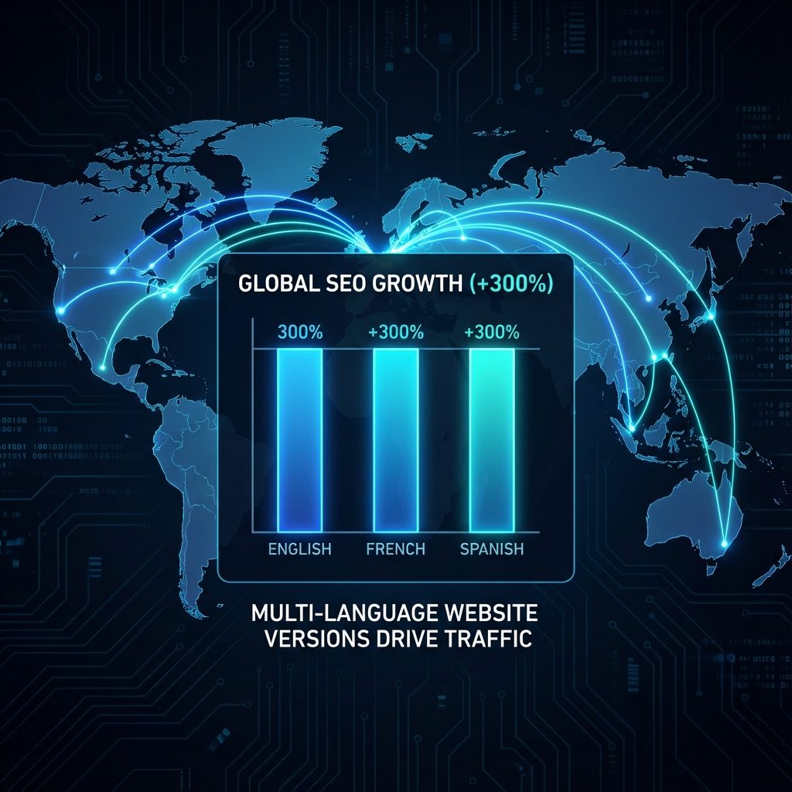

# 🦖 KT (KaijuTranslator)

**The AI-Powered, "Dummy-Proof" Translation Engine for PHP Websites.** 🌍✨

KT is the ultimate tool for developers who want to take their PHP projects global without the complexity. Using **OpenAI**, **DeepSeek**, and **Google Gemini**, KT creates a seamless, multilingual experience while handling all the technical SEO heavy lifting.

---

## 📈 Dominate Global Search (Multi-Country SEO)

KT isn't just a translator; it's an SEO machine. Most tools simple swap text, but KT creates **physical SEO mirrors** that search engines love.

- **Native Subfolders**: Physical directories ( `/en/`, `/fr/` ) ensure 100% crawlability.
- **Smart Hreflang**: Automatically tells Google exactly which version to show in each country.
- **Sitemap Indexing**: Generates multi-language XML sitemaps for instant indexing.
- **Context-Aware Translation**: AI understands your SEO keywords and keeps them intact.

---

## 🧠 Meet the AI Kaiju

Built for the modern web, KT uses Large Language Models to handle the nuances of language. Whether it's complex technical documentation or creative marketing copy, our "Digital Kaiju" breathes life into your global content.

---

## 🚀 Why KT?

- **🧠 Multi-AI Brain**: Choose your favorite engine: **OpenAI (GPT-4o)**, **DeepSeek**, or **Gemini**.
- **⚡ Zero-Touch Integration**: Drop the folder in, run the setup, and you're done. No database, no rewrites.
- **🎨 Premium Visual Dashboard**: A stunning management console to monitor your global growth.
- **🛡️ Stealth Mode**: 100% isolated architecture. Your original site remains untouched and pristine.
- **⚡ High Performance**: Fast file-based caching system for instant page loads.

---

## 🛠️ Quick Start (3 Steps)

### 1. Upload

Drop the `KT/` folder and the entry scripts into your website's root.

### 2. Set Up

Open `yoursite.com/setup.php`. Select your AI provider and start the wizard.

### 3. Build

Access the **KT Dashboard** at `/KT/dashboard.php` and click **"Build Stubs"**. Your global journey starts now!

---

## 🤝 Community & Support

KT is a community-first project. Help us build the most accessible translation engine for PHP!

## 📄 License

MIT License - Keep it open, keep it global.

---
**One PHP file. Three AI brains. Infinite global reach.** 🦖🌍💎
