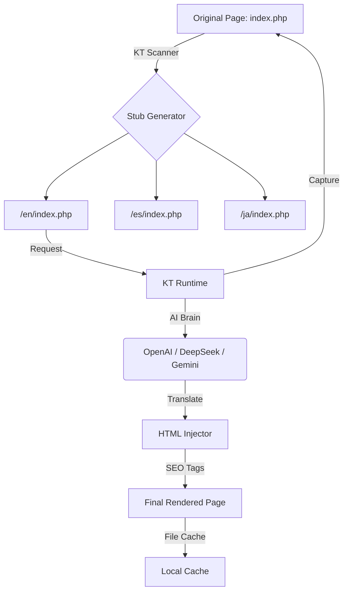

# KaijuTranslator: The Engineering-First PHP Translation Engine

[](https://php.net)
[](#multi-ai-strategy)
[](LICENSE)
[](#engineering-for-seo)

**KaijuTranslator (KT)** is an automated localization engine for PHP that generates **static SEO mirrors** using Large Language Models (**OpenAI, DeepSeek, Gemini**).

Unlike traditional "on-the-fly" JS translators, KT creates physical subdirectories (e.g., `/en/`, `/ja/`) with server-rendered content, ensuring 100% crawlability, proper `hreflang` implementation, and instant performance via file-based caching.


---

## How it Works (The "Physical Mirror" Architecture)

KT follows a "Zero-Rewrite" philosophy. Instead of modifying your existing routing or database, it works at the filesystem level to build a secondary, translated layer of your site.



---

## Engineering For SEO

KT was built with a "Global Growth" mindset. It handles the technical debt of internationalization automatically:

- **Native Subfolders**: Physical directories ensure search engines can index every language version independently.
- **Smart Hreflang**: Automatically injects `<link rel="alternate" hreflang="...">` tags for all active languages.
- **Sitemap Indexing**: Generates per-language XML sitemaps and a parent `sitemap_index.xml`.
- **Canonical Logic**: Automatically handles canonical tags to avoid duplicate content penalties.


---

## Quick Start (Project Integration)

### 1. Via Docker (Instant Demo)

The fastest way to evaluate KT.

```bash
git clone https://github.com/branvan3000/KaijuTranslator.git
cd KaijuTranslator
docker compose up -d
```

Visit `http://localhost:8080` to see the example site in action.

### 2. Standard "Drop-in" Integration

1. Upload the `KT/` folder to your website's root.
2. Place `setup.php` and `uninstall.php` in the root.
3. Open `yoursite.com/setup.php` and follow the wizard.
4. Run "Build Stubs" from the **Dashboard** at `/KT/dashboard.php`.

---

## Multi-AI Strategy

KT supports the world's most powerful LLMs out-of-the-box. Switch providers in seconds via the configuration:

- **OpenAI**: Best for nuanced European languages.
- **DeepSeek**: Exceptional pricing/performance for coding and technical text.
- **Google Gemini**: Massive context window and excellent Asian language support.

---

## Security & Performance

- **Isolation**: 100% self-contained. Deleting `KT/` and language folders reverts your site to its original state instantly.
- **Cache Layer**: File-based caching ensures that after the first AI translation, pages load in **milliseconds**.
- **Privacy**: No tracking. Your API keys are stored locally in `KT/kaiju-config.php`.

---

## Testing & Quality Assurance

KT includes a custom test suite to ensure logic integrity.

To run all tests:

```bash
php KT/tests/run_tests.php
```

The suite covers:

- **Unit Tests**: Logic for `HtmlInjector`, `Router`, and `CliHelper`.
- **Integration Tests**: End-to-end flow from stub request to AI translation.

---

## Community & Contributing

We welcome contributions! Please check out our [CONTRIBUTING.md](CONTRIBUTING.md) to get started.

- [Bug Report Template](.github/ISSUE_TEMPLATE/bug_report.yml)
- [Feature Request Template](.github/ISSUE_TEMPLATE/feature_request.yml)

## License

MIT License. Created by [branvan3000](https://github.com/branvan3000).

---
**Robust PHP translation engineering. Enterprise-grade global reach.**
